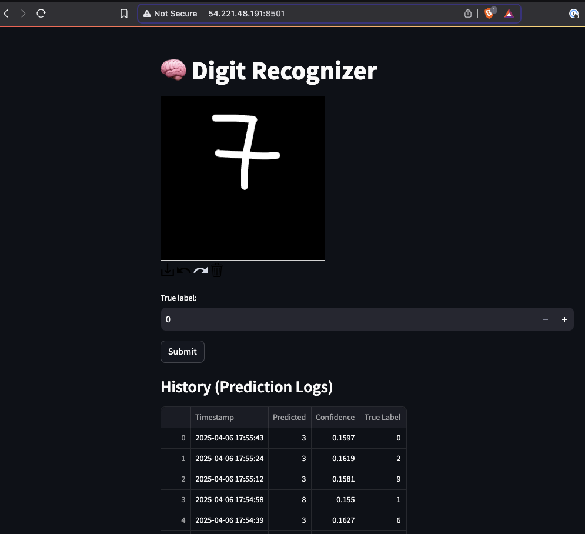

# 🧠 Digit Recognizer (MNIST)

An end-to-end digit recognition web application built with PyTorch, Streamlit, and PostgreSQL, containerized using Docker and deployed on a self-managed server (Ubuntu / AWS EC2).



---

## 🚀 Feature Overview

- Draw digits directly in the browser
- PyTorch model trained on MNIST for digit classification
- Real-time prediction with confidence scores
- Manual label feedback from user input
- Predictions are logged to a PostgreSQL database
- Live table display of past predictions from database
- Fully containerized (Streamlit app + PostgreSQL)
- Deployable on any Docker-compatible server

---

## 🧠 Model Overview

The model is a simple CNN with two convolutional layers, trained on the MNIST dataset using PyTorch. It achieves ~ 99.12% accuracy on the test set and is saved as `models/mnist_cnn.pth` for inference in the web app.

---

## 💻 Setup Instructions

### 1. Clone the repo

```bash
git clone https://github.com/your-username/digit-recognizer-mnist.git
cd digit-recognizer-mnist
```

### 2. Build & Train the model

```bash
pip install -r requirements.txt
python train_model.py
```
This saves the trained model to `models/mnist_cnn.pth`.

### 3. Running Locally

#### a. Local machine

- Add a `.env` file with database credentials in order to use your local Postgres
- Then run:

    ```bash
    streamlit run app.py
    ```

#### b. Docker

- Build and start the container. This will build the Streamlit app container, spin up a PostgreSQL database and initialize the predictions table.

    ```bash
    docker-compose up --build
    ```

- The application will be available at `http://localhost:8501`

### 4. Deployment on a Self-Managed Server

This application has been deployed on an Ubuntu 22.04 instance on AWS. You can access it at `http://54.221.48.191:8501/`

## ✅ Future Improvements
- Collect more training data via feedback
- Improve digit preprocessing
- Retrain model
